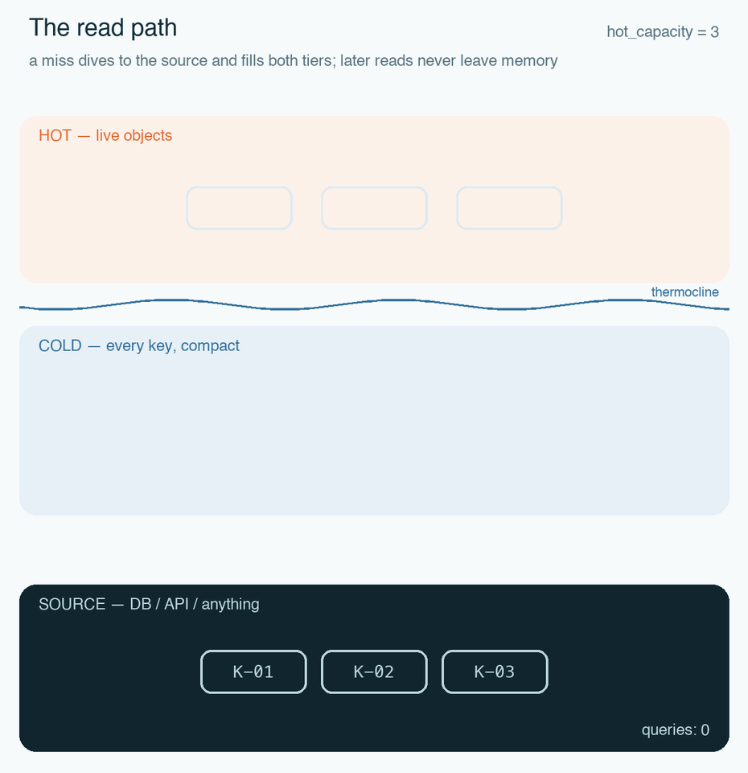
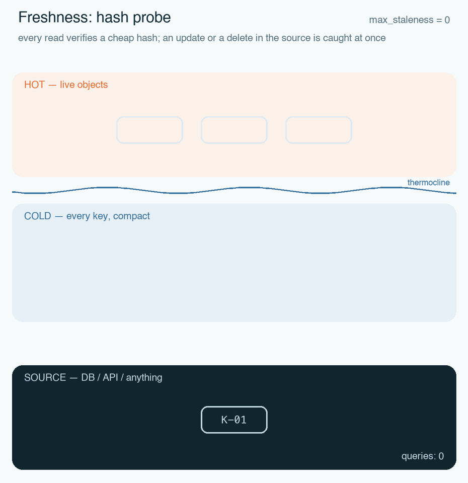
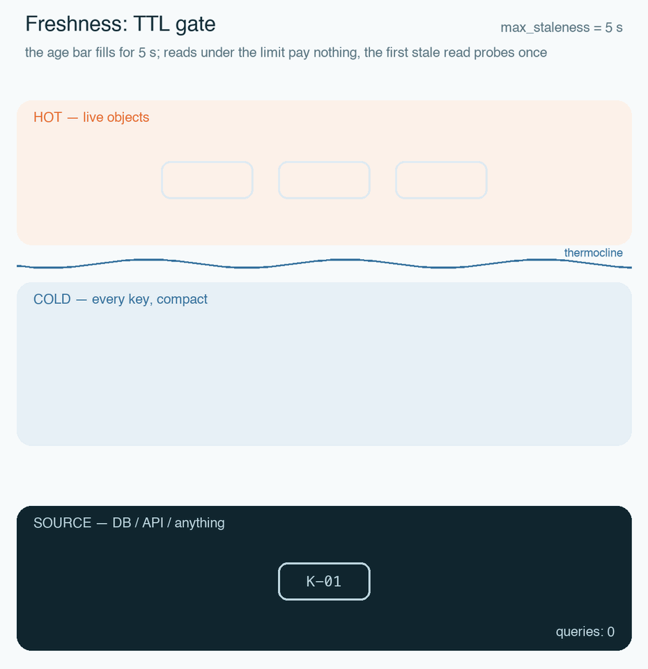
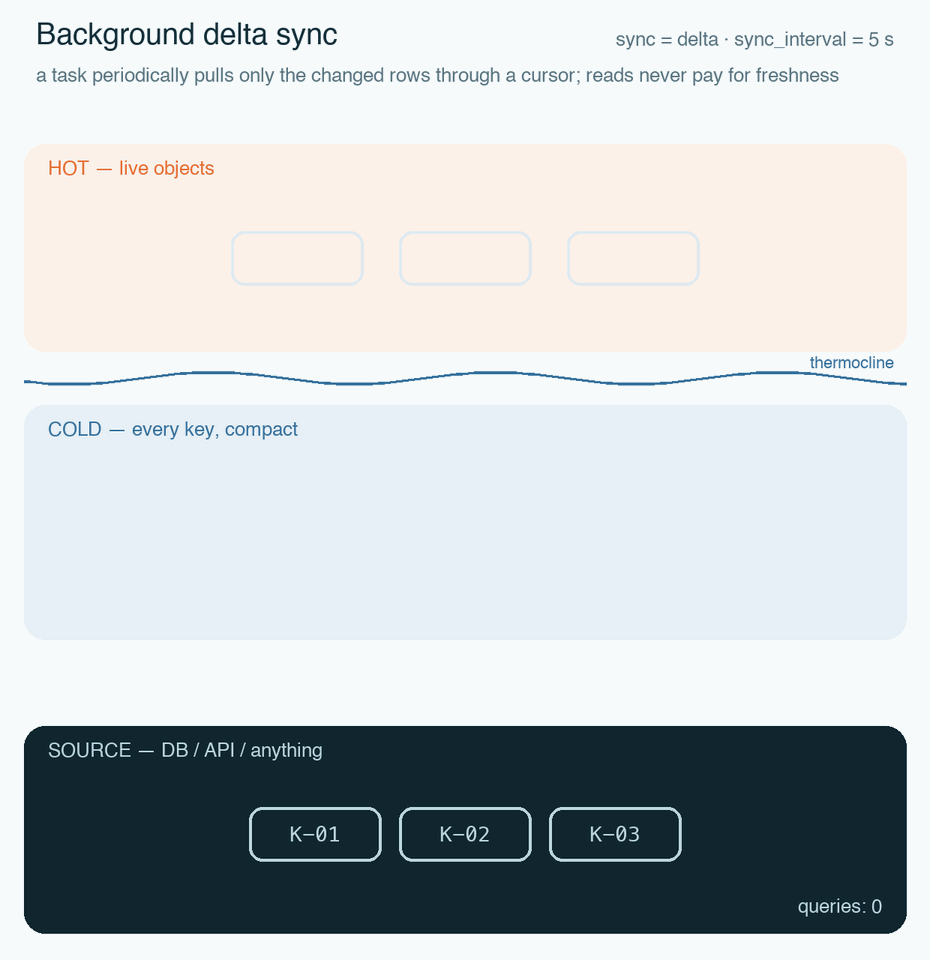
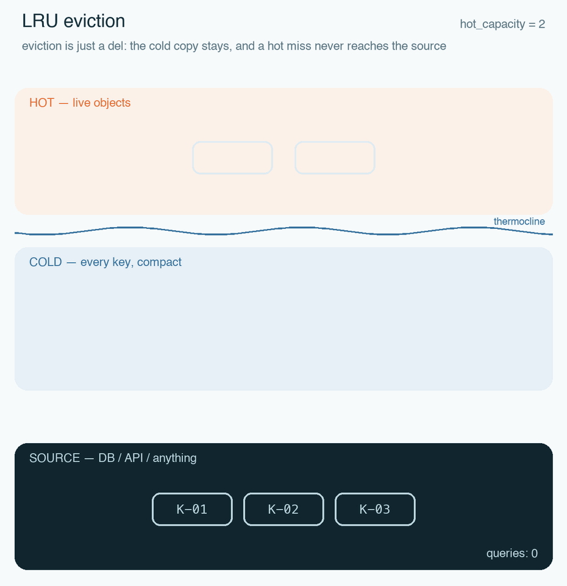
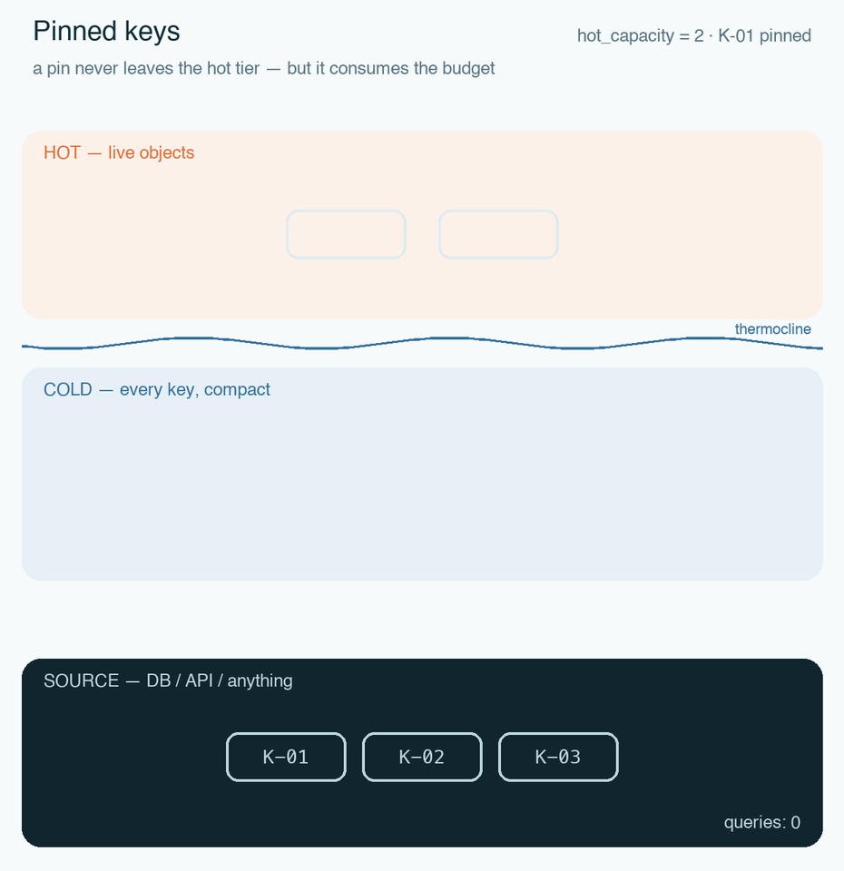

# thermocline

A memory-efficient, tiered read-through cache for read-heavy Python services — hot objects over a compact cold tier, backed by any source.

Named after the ocean layer that separates warm surface water from the cold depths — the same boundary this library draws between hot deserialized objects and their compact cold copies.

## Why

Read-heavy services often hold reference data — product catalogs, pricing plans, feature flags — that is read constantly, changes rarely, and is edited by *another* application. Keeping it all as live Python objects can cost gigabytes; hitting the database on every read costs milliseconds. Thermocline keeps the full dataset in memory in a compact binary form (the **cold tier**) and only the working set as live objects (the **hot tier**), with the source of record as the last resort:



- **Hot tier** — a small LRU-bounded set of live, ready-to-return objects.
- **Cold tier** — *every* known object as a compact envelope `(key, hash, payload)`.
- **Source** — your database or API, reached only on misses and invalidations.

The tiers are inclusive: the hot tier is a subset of the cold one, so eviction is just a `del`, and a hot miss never needs the database.

## Quickstart

```python
from dataclasses import dataclass

from thermocline import CacheSource, JsonSerializer, Thermocline


@dataclass(frozen=True)
class Product:
    id: int
    price: int


class ProductSource(CacheSource[int, Product]):
    async def get(self, key: int) -> Product | None: ...  # load from your store
    def key_of(self, obj: Product) -> int: ...  # return obj.id
    def hash_of(self, obj: Product) -> str: ...  # cheap version hash


serializer = JsonSerializer(
    to_wire=lambda p: {"id": p.id, "price": p.price},
    from_wire=lambda w: Product(id=w["id"], price=w["price"]),
)

cache = Thermocline(ProductSource(), serializer, hot_capacity=10_000, sync=None)
async with cache:
    product = await cache.get(42)  # None if it does not exist
```

The core contract is three methods; everything else is an optional capability that unlocks more efficient behavior.

## Source capabilities

| Capability | Method | Unlocks |
|---|---|---|
| *(core, required)* | `get`, `key_of`, `hash_of` | Read-through caching over anything that can look up by key |
| `SupportsHashProbe` | `get_hash(key)` | Cheap freshness checks without shipping the object |
| `SupportsSnapshot` | `load_all()` | Timer-driven full reloads of the cold tier |
| `SupportsDelta` | `load_changed(cursor)` | Incremental sync: fetch only what changed |

Capabilities are structural — implement the method and the cache detects it. The requested mode is validated against the source's capabilities at construction: nothing degrades silently.

## Freshness: one dial

`max_staleness` is how long a copy may be served without checking, in seconds. The checking mechanism is picked automatically: a cheap hash probe when the source supports it, a full reload otherwise.

| Setting | Behavior | Use for |
|---|---|---|
| `0` | Verify on **every** read | Prices, permissions — anything where staleness costs money |
| `N` seconds | TTL gate: trust for `N` seconds, then verify once | Most reference data |
| `math.inf` | Never verify (explicit opt-in only) | Insert-only / immutable data |

The default is `"auto"`: `0` with a hash probe available, `300` without one. `auto` never picks `inf` — turning verification off is a decision you make explicitly.

Strict mode in action — an update and a deletion, both caught by a probe:



The TTL gate — reads inside the window pay nothing, staleness stays bounded:



Freshness is a property of the read, not only of the object — any call may tighten it:

```python
await cache.get(key)  # cache-wide default
await cache.get(key, max_staleness=0)  # this read must be exact
```

### When the source is down

`stale_grace` is the extra staleness budget allowed while the source is unreachable. Default `0`: the failure propagates. Set a grace window to trade freshness for availability during outages — explicitly, like everything else.

## Background sync

| Mode | Needs | Behavior |
|---|---|---|
| `"delta"` | `SupportsDelta` | Periodically fetch only changes, driven by an opaque source-owned cursor |
| `"snapshot"` | `SupportsSnapshot` | Periodically re-stream the full dataset, atomically swap the cold tier |
| `None` | — | Lazy only: the cache fills as keys are read |

`sync="auto"` prefers delta, falls back to snapshot, and refuses a source that supports neither — pass `None` explicitly for a lazy-only cache. `start()` performs the initial load, so after it returns the cold tier holds the full dataset. Deletions arrive from sync as keys and become tombstones, so the cache also remembers what *does not* exist and answers `None` without touching the source.



## Eviction and pinning

The hot tier is bounded by `hot_capacity` — a count of live objects, the main performance dial. LRU by default; the policy is pluggable (`EvictionPolicy`). Eviction only drops the live object — the compact copy stays in the cold tier:



Pinned keys are never evicted, but they consume the hot budget:



```python
cache.pin(hot_key)  # e.g. today's featured product
cache.unpin(hot_key)
```

## Design principles

- **No silent fallbacks.** Misconfiguration fails at construction with `MisconfiguredCacheError`; `auto` resolutions are visible in `repr(cache)` and properties.
- **Your errors stay yours.** A failing source raises its own exception through the cache, unwrapped.
- **Deletions can't be ignored.** Sync delivers them as keys, probes report them as `None` — a deleted object never masquerades as a live one.
- **Model deactivation as state, deletion as hygiene.** If business logic depends on an object disappearing, flip a status field — the hash catches it instantly; deletion is for data that is truly gone.
- **asyncio-only (v0.1).** A cache instance belongs to one event loop; no locks on the read path.

## Installation

Not yet published to PyPI. From source:

```bash
pip install "thermocline @ git+https://github.com/arturterkazarian/thermocline"
```

Optional extras: `thermocline[msgpack]` for the compact cold-tier codec, `thermocline[sqlalchemy]`, `thermocline[httpx]`, `thermocline[pydantic]` for upcoming adapters.

## Status

Alpha. The source contract, serializers, and the two-tier cache facade are implemented and tested; adapters (SQLAlchemy, httpx, Pydantic), metrics, and batch reads are on the roadmap.

## License

Apache-2.0 — see [LICENSE](LICENSE).
